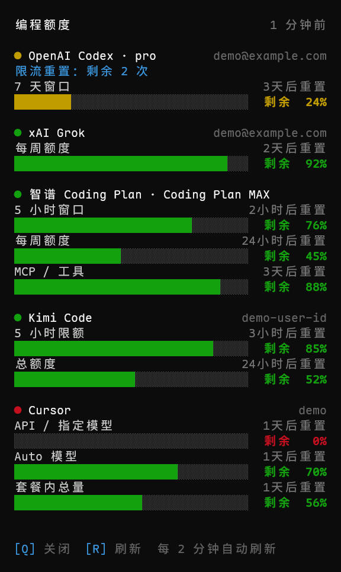

# coding-quota

See the remaining quota of five AI coding plans in one place: **OpenAI Codex, xAI Grok, Zhipu GLM Coding Plan, Kimi Code, and Cursor**.



## Two flavors

| | `coding-quota-desktop.exe` (desktop widget) | `coding-quota.exe` (terminal TUI / CLI) |
| --- | --- | --- |
| UI | Borderless acrylic widget pinned to the desktop | Compact 48-column TUI in a frameless Windows Terminal window |
| Interaction | Drag by the title bar, tray icon context menu | `R` refresh, `Q` quit, auto-refresh every 2 minutes |
| Extras | Launch with Windows, per-provider visibility, window position memory | `--snapshot` plain text, `--json` for scripts, `-p <provider>` to filter, `--demo` for a mock-data preview |

## Download

Grab the latest `coding-quota-*-windows-x86_64.zip` from [Releases](../../releases) and unzip it — keep the two executables and the two MinGW runtime DLLs in the same directory. No installation required.

## Credentials

Zero configuration: the tool reads the existing omp credential store (`~/.omp/agent/agent.db`) read-only and refreshes expiring tokens through omp. Providers without credentials are hidden automatically — nothing ever asks you to log in.

## Features

- Each quota window shows the remaining percentage, a usage-colored bar (green <70%, yellow ≥70%, red ≥90%), and its reset time
- Codex additionally shows remaining rate-limit reset credits
- Failed refreshes keep the last good values (cached in `%APPDATA%\coding-quota\last_good.json`), drawn dimmed with their age; `--json` / `--snapshot` always report the live result
- Both the widget and the TUI fit their size to the content

## Build from source

```
cargo build --release --features gui
```

The Windows target is `x86_64-pc-windows-gnu` (see `.cargo/config.toml` for the linker setup).

## License

MIT
