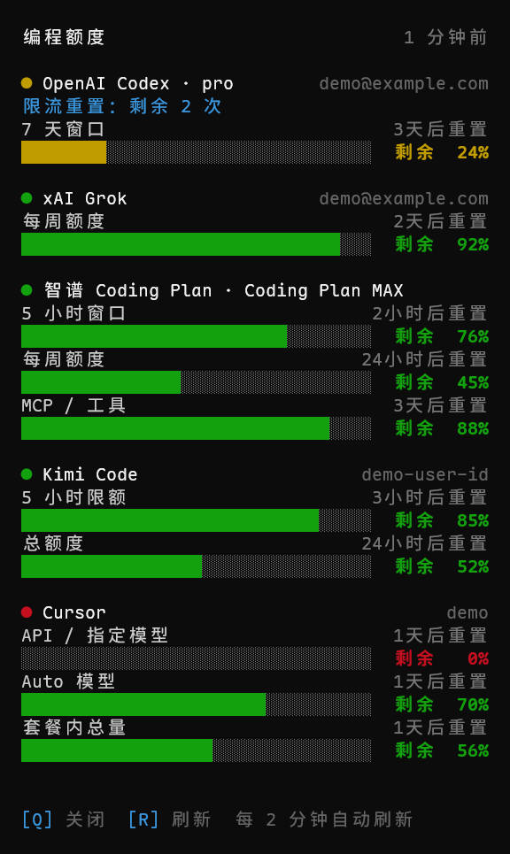

# coding-quota

See the remaining quota of eight AI coding plans in one place: **OpenAI Codex, Claude (Pro / Max), xAI Grok, Zhipu GLM Coding Plan, Kimi Code, Cursor, Devin, and Google Antigravity**.



## Two flavors

| | `coding-quota-gui.exe` (desktop widget) | `coding-quota-tui.exe` (terminal TUI / CLI) |
| --- | --- | --- |
| UI | Borderless acrylic widget pinned to the desktop | Compact 48-column TUI in a frameless Windows Terminal window |
| Interaction | Drag by the title bar, scroll overflowing cards, tray icon context menu | `R` refresh, `Q` quit, `↑↓` / `PgUp` / `PgDn` / `Home` / `End` scroll, auto-refresh every 2 minutes |
| Extras | Launch with Windows, per-provider visibility, window position memory | `--snapshot` plain text, `--json` for scripts, `-p <provider>` to filter, `--demo` for a mock-data preview |

## Download

Grab the executables from [Releases](../../releases):

- `coding-quota-tui.exe` — terminal TUI / CLI
- `coding-quota-gui.exe` — desktop widget

Both are standalone (only Windows system DLLs are linked), no installation required.

## Credentials

Zero configuration: the tool reads the existing omp credential store (`~/.omp/agent/agent.db`) read-only and refreshes expiring tokens through omp. Providers without credentials are hidden automatically — nothing ever asks you to log in.

## Features

- Each quota window shows the remaining percentage, a usage-colored bar (green <70%, yellow ≥70%, red ≥90%), and its reset time
- Codex additionally shows remaining rate-limit reset cards and its credit balance (including Pro plans) directly under the corresponding window's progress bar (`重置卡：剩余 X 次` / `积分：剩余 X`), exactly matching Zhipu's style; finite balances retain decimals, unlimited credits are labelled explicitly, and unavailable balances are not shown as zero
- Zhipu shows available reset cards separately for the 5-hour and weekly windows; only records marked available are counted, and a reset-inventory query failure does not hide regular usage. Inventory queries are read-only: this tool never spends reset cards. The monthly MCP/tool quota shows remaining counts (`剩余 3925/4000`), not just a percentage
- Antigravity shows Gemini and shared Claude/GPT quotas, each with 5-hour and weekly windows, remaining percentages and reset times. The Claude/GPT buckets belong to Antigravity, not standalone Claude or Codex subscriptions; each shared bucket is displayed once. The existing active omp `google-antigravity` OAuth login supplies the token and project; use `--provider antigravity` or `--provider google-antigravity` to filter it
- Token usage per card: local OMP session logs are aggregated into last 1 day / 7 days / 30 days / local-total rows (input+output+reasoning+cache), with model breakdowns in `--json`; Zhipu additionally shows the server-side official 30-day total. "Local total" only counts logs still on this machine, not the provider's lifetime total; providers without usable logs show no usage line
- Quota alerts fire native Windows tray notifications when a window's remaining percentage crosses a threshold: dropping to ≤10%, hitting zero, or resetting back to full. Alerts trigger only on real transitions observed at runtime (cache-seeded on startup, no replay); the tray menu has an on/off toggle and a "测试通知" entry to verify the channel
- `--json` exposes Codex `credit_balance` (`kind: limited` with `balance`, or `kind: unlimited`) and each Zhipu window's optional `resets_left`; missing fields mean unknown, while a known empty reset-card inventory is zero
- Failed refreshes keep the last good values (cached in `%APPDATA%\coding-quota\last_good.json`), drawn dimmed with their age; values older than 24 hours are dropped rather than shown, and a provider that keeps failing is retried with backoff instead of every round. `--json` / `--snapshot` always report the live result
- Both the widget and the TUI fit their size to the content

## Build from source

```
cargo build --release --features gui
```

The Windows target is `x86_64-pc-windows-gnu` (see `.cargo/config.toml` for the linker setup).

## License

MIT
